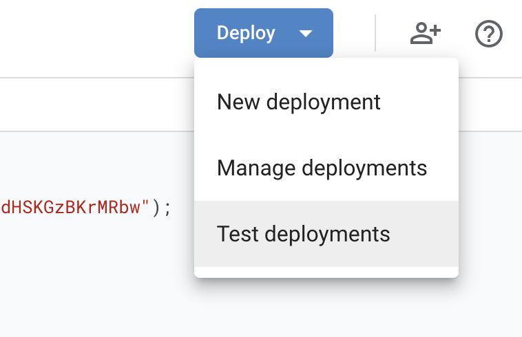
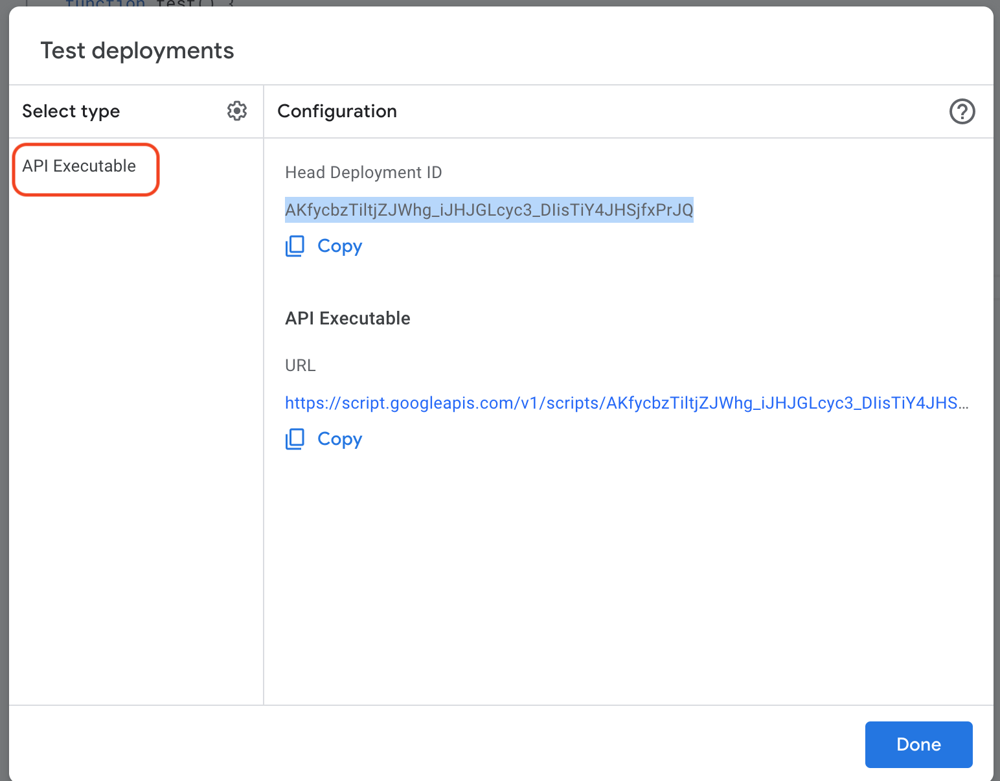
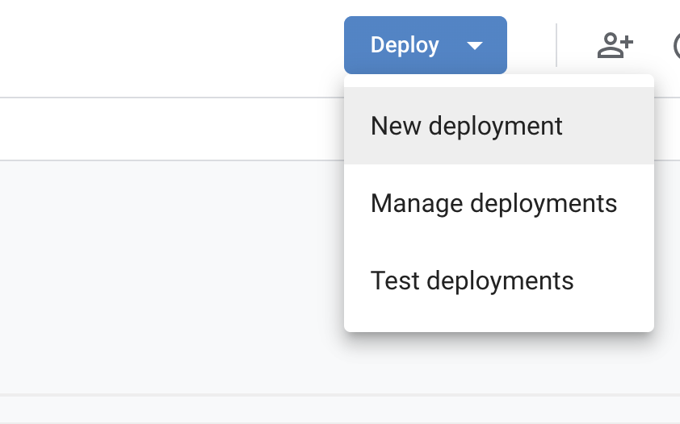
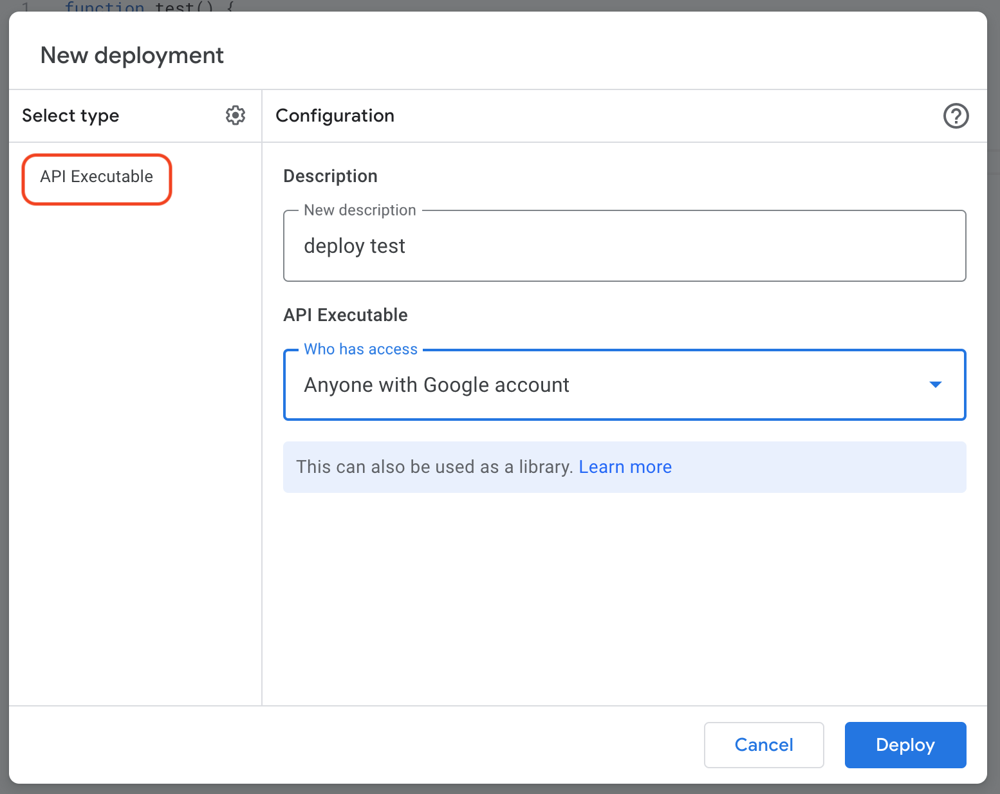
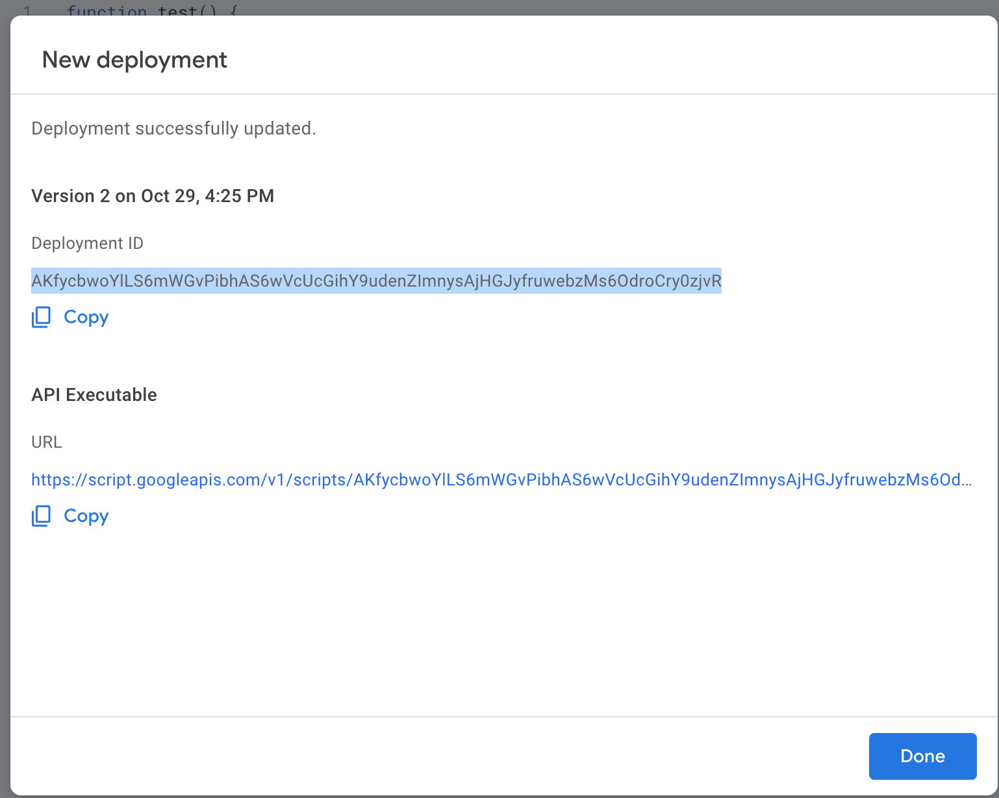
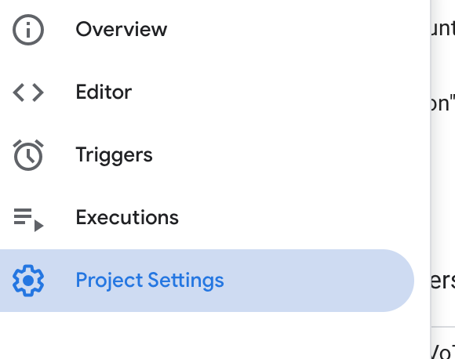
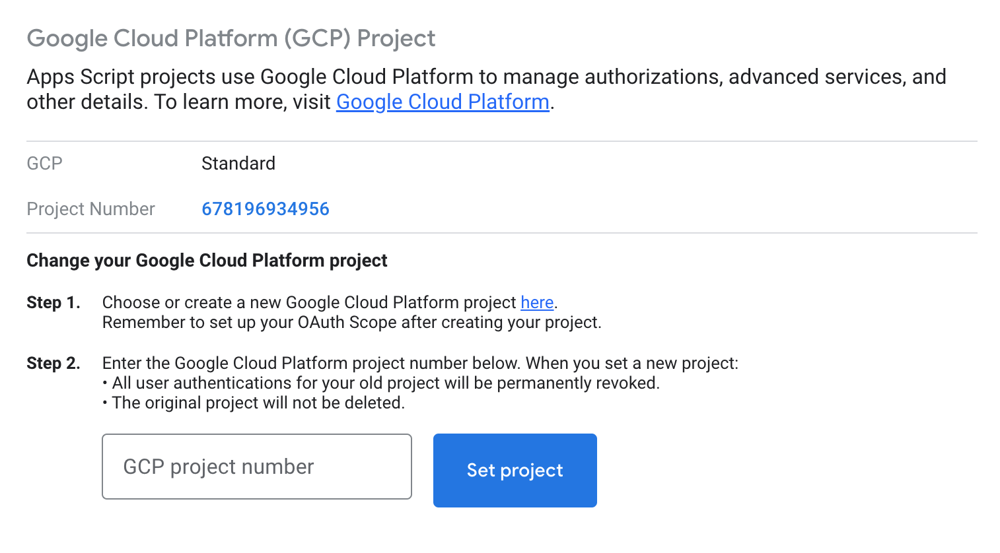
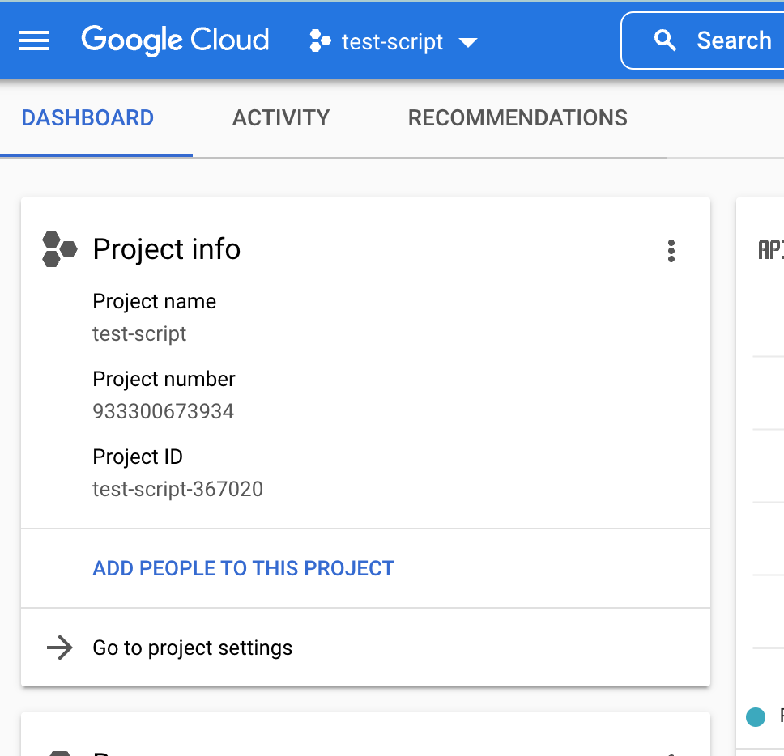
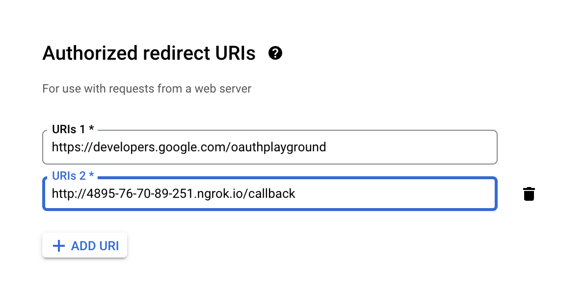

# Examples

https://github.com/pkboom/google-cloud/tree/master/apps-script/routes/routes

# Google Auth

https://github.com/pkboom/google-cloud/tree/master/oauth

# Enable Apis

- Apps Script API

- Google Drive API

# Use head deployment id for development



---



# Deploy a script

> When a script is ready to be deployed in public



---



---



> Copy `Deployment ID` to code

# Set Project ID



---



---



# Share

```sh
valet share
```

# Set up google env variables

```
// .env
GOOGLE_CLIENT_ID="..."
GOOGLE_CLIENT_SECRET="..."
GOOGLE_REDIRECT="http://....ngrok.io/callback"
```

# Set up redirect in google cloud



> [google apps script](https://script.google.com/home/my)

> [google app script reference](https://developers.google.com/apps-script/reference)

> [OAuth 2.0 Playground](https://developers.google.com/oauthplayground/)

> [Google APIs Client Library for PHP](https://github.com/googleapis/google-api-php-client)

> [Advanced Docs Service](https://developers.google.com/apps-script/advanced/docs)
